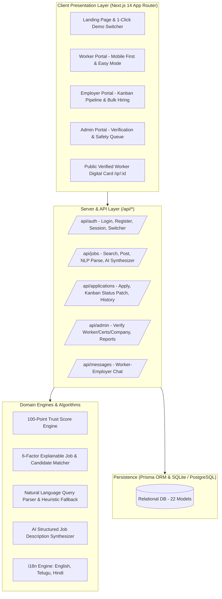

# Blue Workforce Connect '26
> **"Skills that speak. Opportunities that connect."**

[](https://github.com/BHANU-PHANINDRA-V/wooble-hackathon-workforce)
[](https://nextjs.org/)
[](https://prisma.io/)
[](https://typescriptlang.org/)
[](https://tailwindcss.com/)

---

## 1. Challenge & Vision

In India, over **450 million blue-collar and skilled trade workers** (electricians, welders, plumbers, technicians, drivers, mechanics, warehouse operators, and construction workers) face severe recruitment friction:
- **No Verifiable Professional Identity**: Traditional resumes do not work for skilled trades where practical competency matters more than formatting.
- **Trust Deficit**: Employers struggle to verify NCVT/ITI certifications, licensing boards, and past on-site safety records.
- **Fragmented Hyperlocal Discovery**: Commute radius and shift preferences are critical for workers, yet standard job boards lack commute-aware matching.
- **Manual, Slow Recruitment**: High-volume recruiters (warehouses, infrastructure builders, logistics hubs) lack Kanban pipeline tools and bulk hiring campaign trackers.

**Blue Workforce Connect** solves this end-to-end through a verification-first digital identity, a transparent 100-point Trust Score engine, explainable AI job matching, a drag-and-drop recruitment Kanban board, bulk hiring campaign tools, and accessibility for low-digital-literacy workers.

---

## 2. Key Differentiators & "WOW" Features

| Feature | Description | Target User |
|---|---|---|
| **Verified Worker Digital Identity** | Replaces paper resumes with authenticated NCVT credentials, tested trade skills, safety records, and practical work proof photos. | Worker / Employer |
| **Transparent Trust Score (0-100)** | Explainable 7-pillar trust rating (*Why is my score 92?*) based on identity, verified skills, active licenses, experience, and employer ratings. | Worker / Employer / Admin |
| **Digital ID Card with Live QR Code** | Professional scannable identity card with Web Share & WhatsApp share buttons linking to `/qr/:id` public verified bio. | Worker / Contractor |
| **Explainable 94% Job Matching** | 6-factor algorithm (Skills 40pts, Exp 20pts, Radius 15pts, Shift 10pts, Salary 10pts, Certs 5pts) with human-readable checkmarks. | Worker / Employer |
| **Interactive Recruitment Kanban** | Stage candidates across *Applied → Screening → Shortlisted → Interview → Hired* with persistent audit logging and worker alerts. | Employer |
| **Bulk Hiring Campaigns** | Specialized dashboard for mass hiring (e.g. *50 Warehouse Workers for Swiggy Logistics*) with progress targets and batch actions. | Employer |
| **AI Job Description Assistant** | Synthesizes plain prompts (*"Need 10 electricians for solar plant"*) into structured duties, required tools, safety gear, and salary benchmarks. | Employer |
| **Natural Language Search** | Plain language search (*"Electrician job near Hyderabad above 25000"*) with heuristic NLP entity extraction fallback. | Worker |
| **Multilingual & Easy Mode** | Full UI localization in English, Telugu (తెలుగు), and Hindi (हिंदी) + high-contrast, extra-large touch target accessibility mode. | Low-Literacy Workers |

---

## 3. Demo Credentials & 1-Click Evaluation Hub

The platform includes a **Sticky 1-Click Demo Bar** at the top of every screen to instantly switch between pre-seeded evaluation roles:

| Role | Demo Email | Password | Pre-seeded Persona & Data |
|---|---|---|---|
| **Worker** | `worker@demo.com` | `Demo@1234` | **Rahul Kumar** — Industrial Electrician, 6 Yrs Exp, 92 Trust Score, Cherlapally, Hyderabad. |
| **Employer** | `employer@demo.com` | `Demo@1234` | **Tata Projects Limited** (Vikram Sharma, HR Lead) — 8 Open Jobs, 68 Applications, Kanban Pipeline. |
| **Admin** | `admin@demo.com` | `Demo@1234` | **Platform Trust Lead** — Credential verification queue, moderation, platform metrics. |

---

## 4. Architecture & System Design



---

## 5. Critical 5–8 Minute End-to-End Judge Walkthrough

### Flow 1: Worker Experience (Rahul Kumar - Industrial Electrician)
1. Open the platform → Click **Worker (Rahul K. - 92 Trust)** on the top Demo Bar.
2. View **Worker Dashboard**:
   - Check **Trust Score 92/100** badge. Click it to inspect the 7-pillar breakdown checklist.
   - Inspect **95% Profile Strength** and career demand insights for Telangana.
   - Review personalized **Recommended Jobs** showing **94% Match**. Click the match badge to view the 6-factor radar and reason checklist.
3. Open **Digital ID Card** (`/worker/card`):
   - View professional digital badge with trade verified badges and live QR code.
   - Test **WhatsApp Share** / Web Share.
4. Try **Job Discovery** (`/worker/jobs`):
   - Search using natural language: *"Electrician job near Hyderabad above 25000"*.
   - Click **Quick Apply** on any role and view real-time timeline on **My Applications** (`/worker/applications`).

### Flow 2: Employer Experience (Tata Projects Limited)
1. Click **Employer (Tata Projects)** on the top Demo Bar.
2. View **Employer Dashboard**:
   - Inspect Recruitment KPI cards (8 Open Jobs, 68 Applications, 18 Shortlisted, 12 Interviews, 7 Hired).
   - View **Visual Hiring Funnel** conversion rates.
3. Open **Recruitment Kanban Pipeline** (`/employer/pipeline`):
   - Drag/progress candidates across columns (*Applied → Screening → Shortlisted → Interview → Hired*).
   - Notice audit timestamp log update and worker notification.
4. Open **Bulk Hiring Dashboard** (`/employer/bulk-hiring`):
   - Review mass recruitment campaigns (*50 Warehouse Workers for Swiggy Logistics*).
5. Post a new Job (`/employer/jobs/new`):
   - Click **AI Description Assistant** → Type *"Need 10 electricians for a solar plant"* → Click **Generate** → Watch structured duties, tools, safety PPE, and salary auto-populate!

### Flow 3: Admin & Trust Verification
1. Click **Admin (Verification Queue)** on the top Demo Bar.
2. Review pending government trade licenses and apprentice credentials.
3. Click **Approve Credential** (+15 Trust Points) or **Reject** with feedback.

---

## 6. Database Schema (22 Relational Models)

The data model is designed with strict relational integrity using Prisma ORM:

- **User**: Authentication, role (`WORKER`, `EMPLOYER`, `ADMIN`), phone, avatar, verification status.
- **WorkerProfile**: Trade occupation, bio, experience years, salary expectation, GPS coordinates, preferred radius, shift, Trust Score, completeness.
- **WorkerSkill**: Skill relation, proficiency level (`BEGINNER`, `SKILLED`, `EXPERT`), years, verification badge.
- **Certification**: License name, issuing board (NCVT/NSDC/State Board), license number, issue/expiry dates, document URL, verification status.
- **Experience**: Employer, role, duration, equipment used, trade description.
- **WorkSample**: Practical work photos (panel wiring, welding beads, piping installations).
- **Company**: Enterprise details, GSTIN number, verification status, contact info.
- **EmployerProfile**: Company association, recruiter designation, department.
- **Job**: Category, openings, experience range, salary range, shift, perks (Food, Transport, PF/ESI, Accommodation), bulk hiring flag, target hires.
- **JobSkill**: Mandatory and optional required skills per job.
- **Application**: Status (`APPLIED`, `SCREENING`, `SHORTLISTED`, `INTERVIEW`, `SELECTED`, `OFFER`, `HIRED`), match score, explainable breakdown JSON.
- **ApplicationStatusHistory**: Full audit trail of stage changes with timestamps and user identifiers.
- **Interview**: Offline/online interview scheduler, site location, instructions, status.
- **Review**: Multi-criteria 5-star ratings (Skill, Reliability, Punctuality, Workplace).
- **Conversation & Message**: Contextual worker-employer messaging.
- **JobAlert & Report**: Alert subscriptions and safety dispute reports.

---

## 7. Local Setup & Execution

### Prerequisites
- Node.js `v18+` or `v20+`
- npm `v9+`

### Installation Commands
```bash
# 1. Clone repository
git clone https://github.com/BHANU-PHANINDRA-V/wooble-hackathon-workforce.git
cd wooble-hackathon-workforce

# 2. Install dependencies
npm install

# 3. Synchronize database schema & populate rich seed dataset
npx prisma db push
npm run seed

# 4. Start local development server
npm run dev
```

Open **http://localhost:3000** in your browser.

---

## 8. Team & Hackathon Submission

- **Platform**: Blue Workforce Connect '26
- **Repository**: [https://github.com/BHANU-PHANINDRA-V/wooble-hackathon-workforce](https://github.com/BHANU-PHANINDRA-V/wooble-hackathon-workforce)
- **Challenge**: Wooble Blue Workforce Connect '26 Challenge
